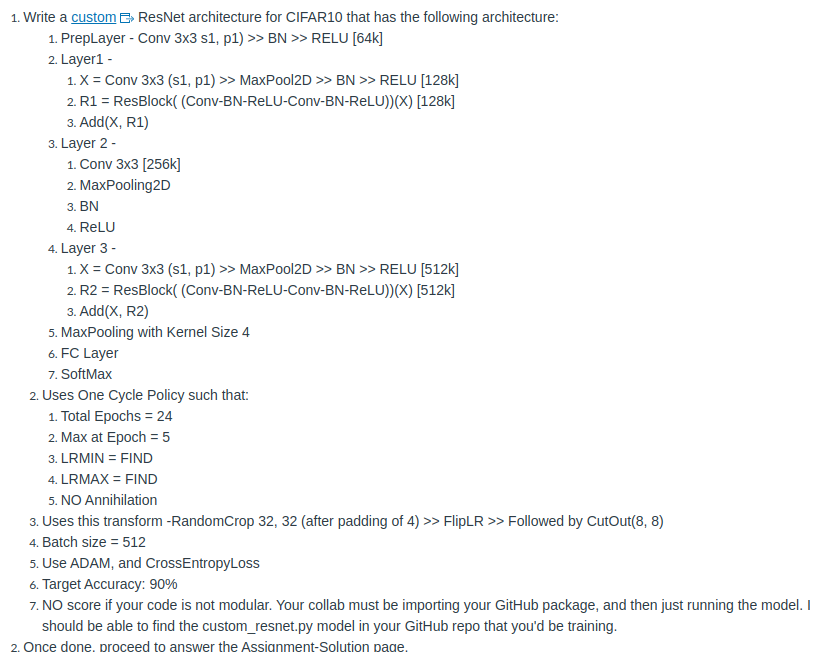
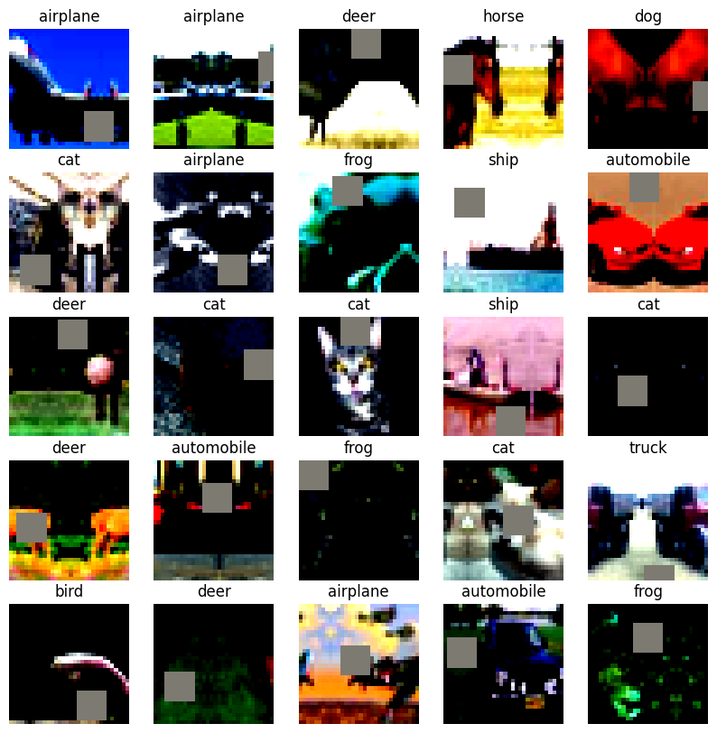
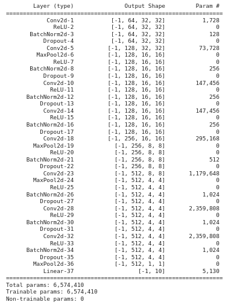
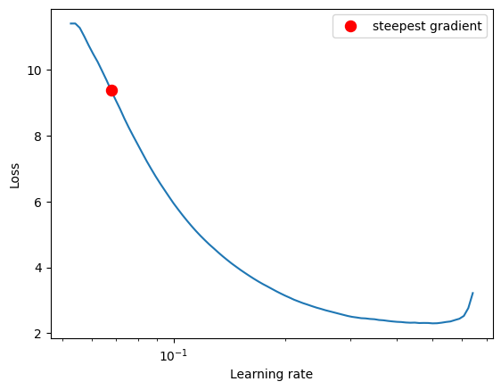
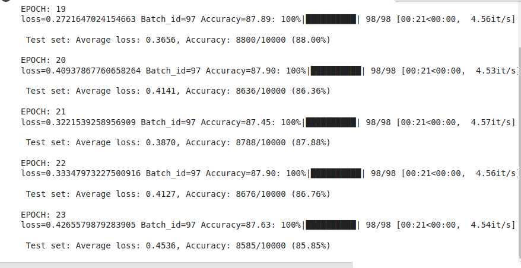
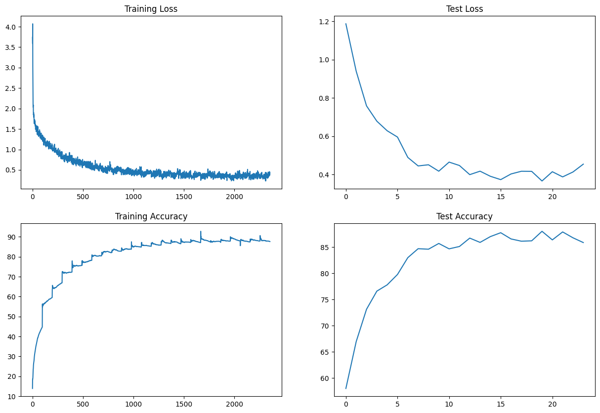

# Problem Statement

# Sample Images

# Model structure and number of parameters

# Finding suggested learning rate using One cycle policy
**Learning rate** = 0.04

**Weight Decay** = 1e-4

**Suggested learning rate from LR finder** = 5.22E-02

# Model Performance

| Number of Parameters | Train Accuracy | Test Accuracy |
|----------------------|----------------|---------------|
| 6,574,410            | 87.90%         | 88.00%        |

# Misclassified Imges

