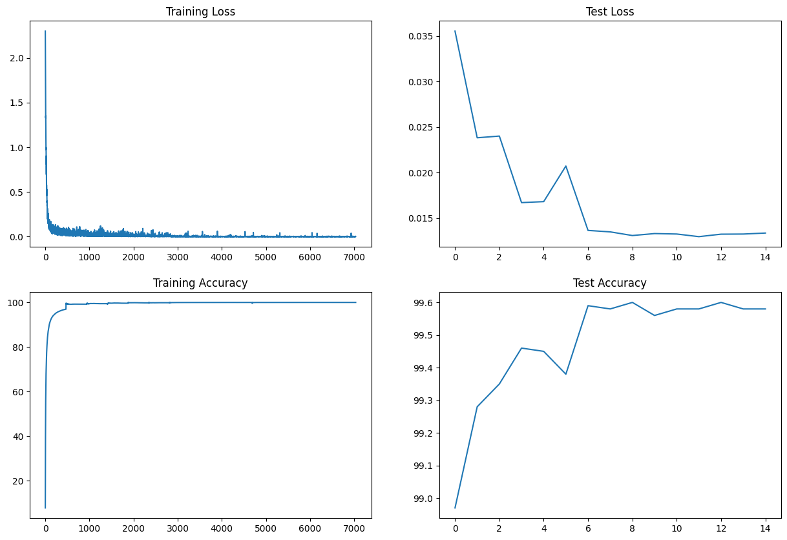
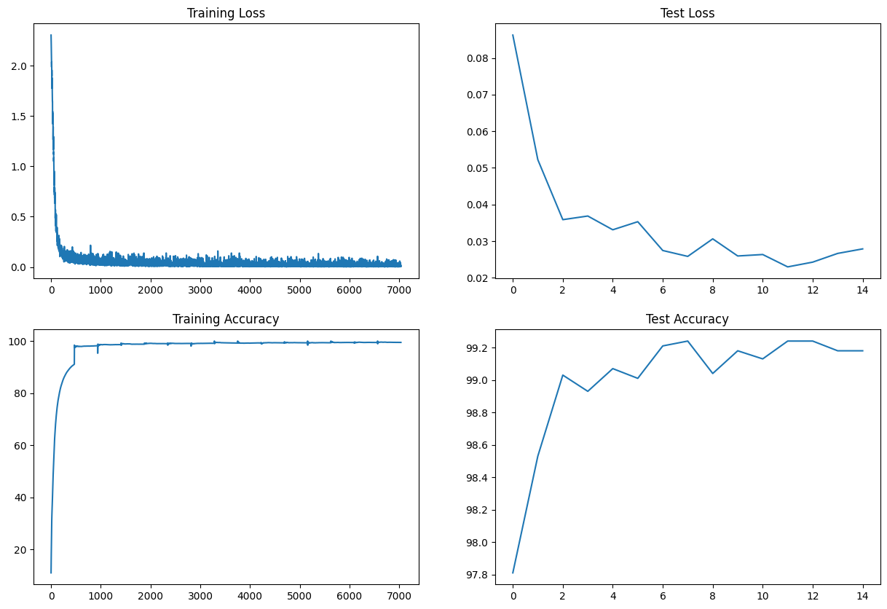
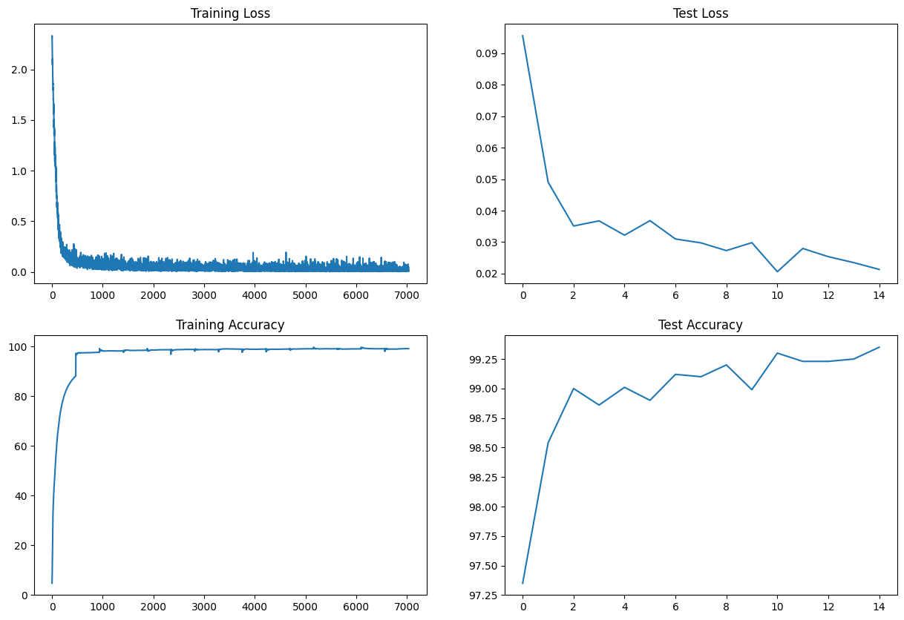
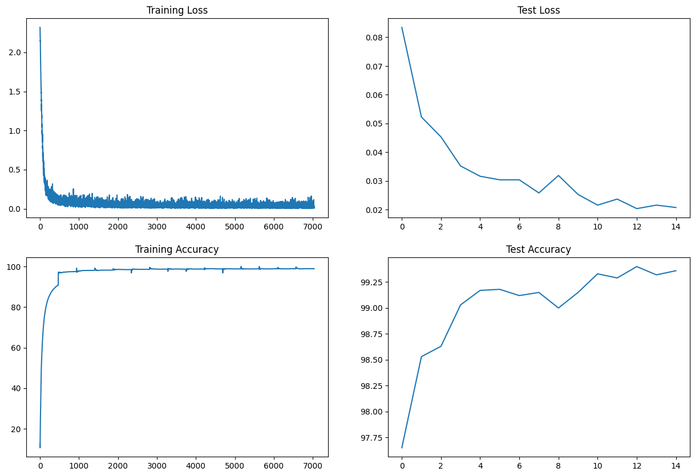
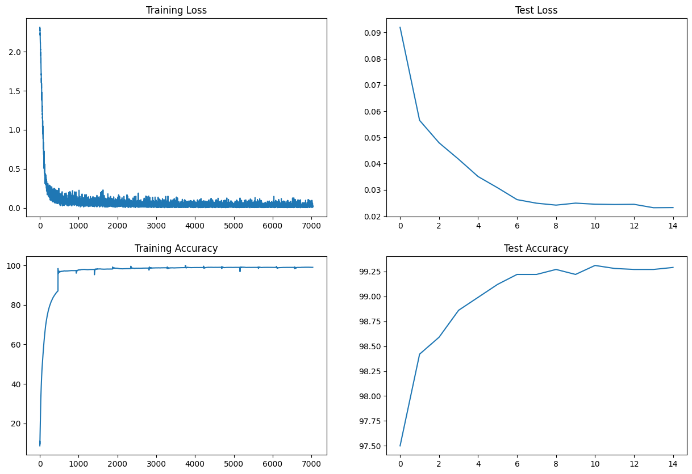

# Assignment:

  1. Target is:
     1. 99.4% __(this must be consistently shown in your last few epochs, and not a one-time achievement)__
     2. Less than or equal to 15 Epochs
     3. Less than 8000 Parameters
     4. Do this using your modular code. Every model that you make must be there in the model.py file as Model_1, Model_2, etc.
  2. Do this in exactly 3 steps
  3. Each File must have a "target, result, analysis" TEXT block (either at the start or the end)
  4. You must convince why have you decided that your target should be what you have decided it to be, and your analysis MUST be correct. 
  5. Evaluation is highly subjective, and if you target anything out of the order, marks will be deducted. 
  6. Explain your 3 steps using these targets, results, and analysis with links to your GitHub files (Colab files moved to GitHub). 
  7. Keep Receptive field calculations handy for each of your models. 
  8. If your GitHub folder structure or file_names are messy, -100. 
  9. When ready, attempt SESSION 7 -Assignment Solution

## STEP-1 (Get the basic setup right)
    Target:
    
        -- Get the set-up right
        -- Set Transforms
        -- Set Data Loader
        -- Set Basic Working Code
        -- Set Basic Training  & Test Loop
        -- Use batch normalisation 
    
    Results:
    
        -- Parameters: 776,160
        -- Best Training Accuracy: 100.00
        -- Best Test Accuracy: 99.60
  
    
    
    Analysis:
    
        -- The accuracy is really good. 
        -- The model is starting to overfitting in last few eopchs as the test accuracy is decreasing along with the training accuracy
        -- model is heavy. 776K parameters are really heavy
 

## STEP-2 (Reducing the number of parameters)
    Target:
    
        -- Our previous model has 776K parameters. I want to reduce these parameters here. I want to make them < 8K
    
    Results:
    
        -- Parameters: 7,330
        -- Best Training Accuracy: 99.48
        -- Best Test Accuracy: 99.24
     
    
    Analysis:
    
        -- The accuracy has dropped from 99.60 to 99.24 after reducing the number of parameters
        -- training and test accuracy are increasing with epochs. So we are in the right path. We might improve results by training it for few more epochs. We will keep number of epochs to 15 and increase it if required in future

## STEP-3 (Introducing dropouts)

   
    Target:
    
        -- In the previous step, the accuracy reduced to 99.24 because we reduced the parameters. In this step we want to
        improve this accuracy by using dropouts. We will use a dropout rate of 0.05 
    
    Results:
    
        -- Parameters: 7,330
        -- Best Training Accuracy: 99.16
        -- Best Test Accuracy: 99.35
     
    
    Analysis:
    
        -- We can see that accuracy has increased from 99.24 to 99.35.
        -- The test accuracy is more than train accuracy because we are dropping 5% of the neurons in the training. 

## STEP-4 (Introduction Image augmentation)
    Target:
    
        -- To increase accuracy we want the model to train on more difficult data. So we are introducing image augmentation in this step
    
    Results:
    
        -- Parameters: 7,330
        -- Best Training Accuracy: 98.94
        -- Best Test Accuracy: 99.40
   

    Analysis:
    
        -- The accuracy has improved a little compared to previous step (from 99.36 to 99.40)
        -- The training accuracy is increasing but test accuracy is fluctuating a little. The model is not able to find the minima. So, we need to introduce learning rate schedular so that learning rate reduces with epochs and does not overshoot

## STEP-5 (Introducing learning rate)
    Target:
    
        -- In the last step, we saw that the training accuracy is increasing but the test accuracy is going up and down a little (which means the model is not able to find minima). So, we want to introduce learning rate scheduler now
    
    Results:
    
        -- Parameters: 7,330
        -- Best Training Accuracy: 99.05
        -- Best Test Accuracy: 99.29
      
    
    Analysis:
    
        -- The accuracy has dropped a little (from 99.40 to 99.29) after introducing learning rate scheduler.
        -- The test accuracy is more accurate now. We can still improve the model if we train it for few more epochs
