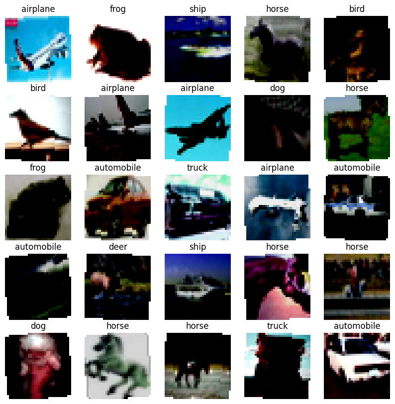
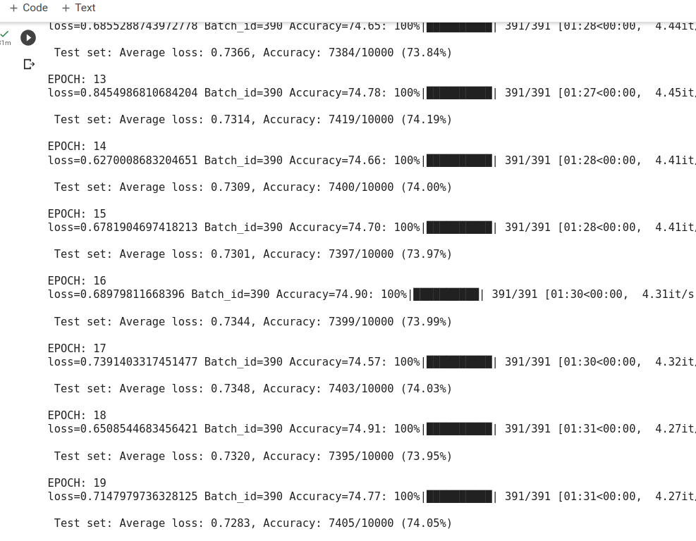
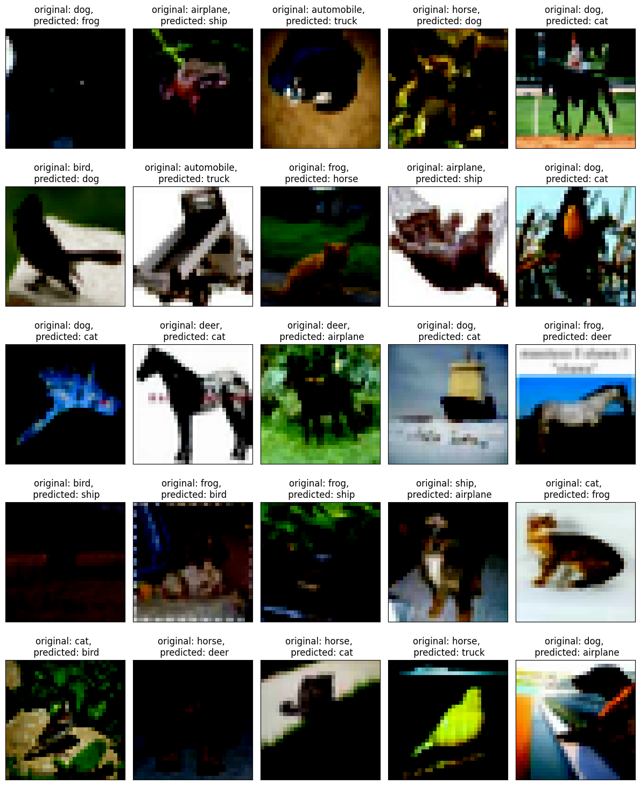
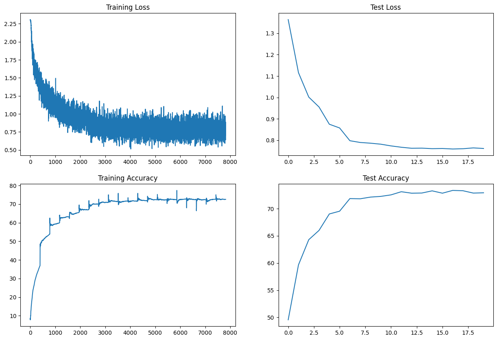
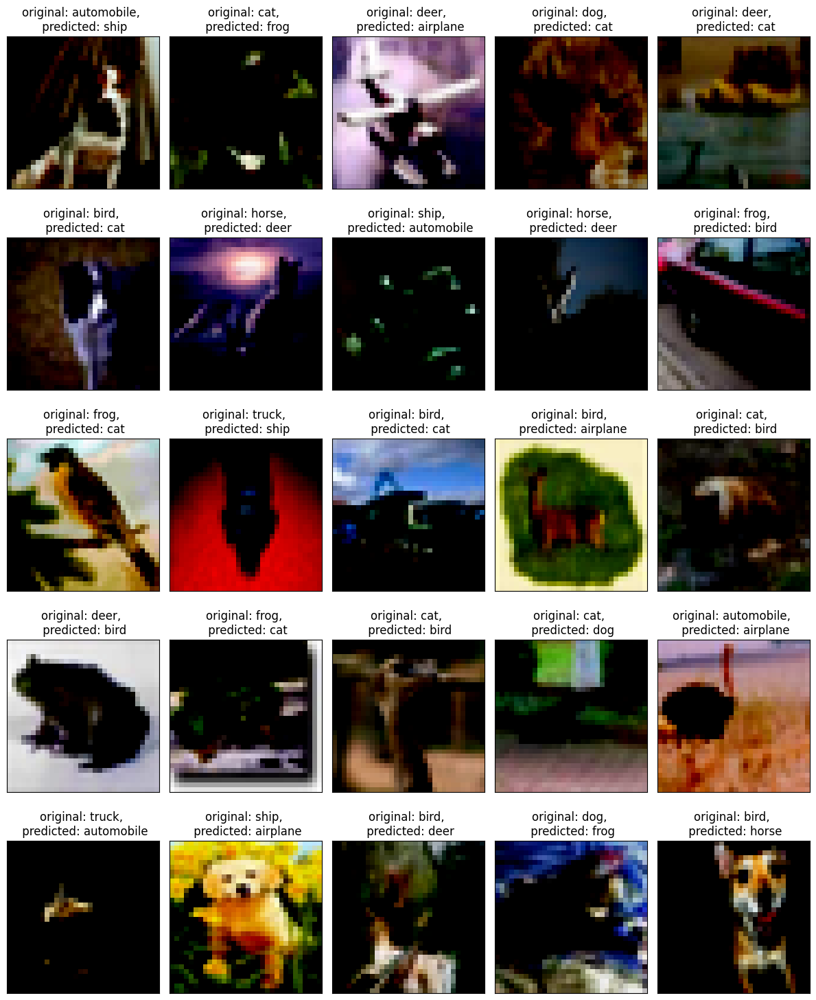
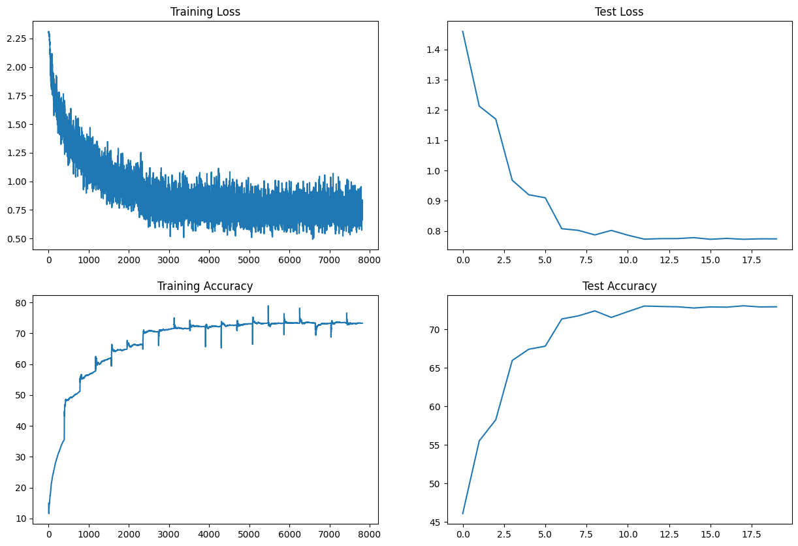
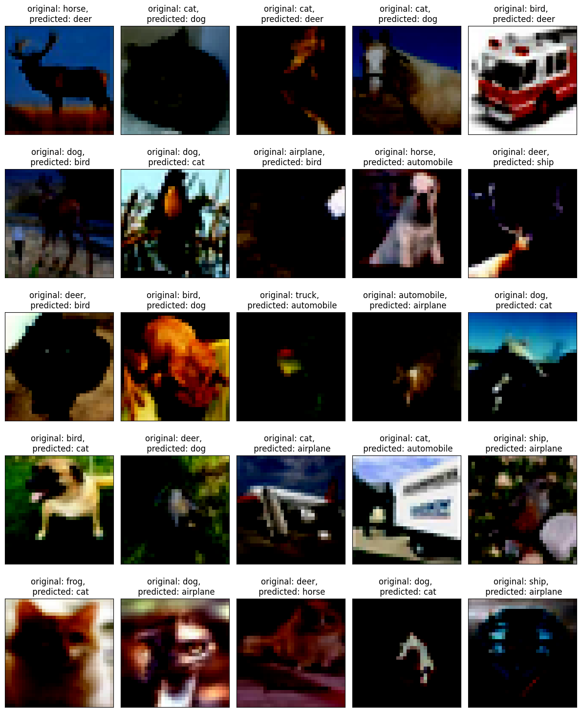

# ASSIGNMENT

### Assignment is:
#### 1. Change the dataset to CIFAR10
#### 2. Make this network:
        2.1 C1 C2 c3 P1 C3 C4 C5 c6 P2 C7 C8 C9 GAP C10
        Keep the parameter count less than 50000
        Try and add one layer to another
        Max Epochs is 20
#### 3. You are making 3 versions of the above code (in each case achieve above 70% accuracy):
        Network with Group Normalization
        Network with Layer Normalization
        Network with Batch Normalization
#### 4. Share these details
        Training accuracy for 3 models
        Test accuracy for 3 models
#### 5. Find 10 misclassified images for the BN model, and show them as a 5x2 image matrix in 3 separately annotated images. 
        
#### 6. write an explanatory README file that explains:
        what is your code all about,
        your findings for normalization techniques,
        add all your graphs
        your collection-of-misclassified-images 
#### 7. Upload your complete assignment on GitHub and share the link on LMS

### Solution:
The main code is in this [notebook](https://github.com/Nishant7007/ERA_V1/blob/main/Session_8%20_Batch_Normalization_And_Regularization/main.ipynb)

Following are the accuracies for all the three normalisaton techniques:

| **Normalisation**     | **Number of parameters** | **Train Accuracy** | **Test Accuracy** | 
|-----------------------|--------------------------|--------------------|-------------------|
| Batch Normalisation   | 38,458                   | 74.77%             | 74.05%            |
| Layer Normalisation   | 38,458                   | 72.53%             | 72.91%            |
| Group Normalisation   | 38,458                   | 73.28z5            | 72.90%            |
####
    Following are some of the sample images:
    
    
#### Batch Normalisation: 
    we started with Batch Normalisation. Following are the results of last 10 epochs
 
####
     We got training accuracy of 74.77% and test accuracy of 74.05%
####
    Following are the accuracy and loss plots for training and test set
 
####
    Following are some of the misclassified images
 

#### Layer Normalisation: 
    Then we tried Batch Normalisation. Following are the results of last 10 epochs
 
####
     We got training accuracy of 72.53% and test accuracy of 72.91%
####
    Following are the accuracy and loss plots for training and test set
 
####
    Following are some of the misclassified images
 

#### Group Normalisation: 
    we then tried Group Normalisation. Following are the results of last 10 epochs
 
####
     We got training accuracy of 73.28% and test accuracy of 72.90%72.90%
####
    Following are the accuracy and loss plots for training and test set
 
####
    Following are some of the misclassified images
   
    
    
 
