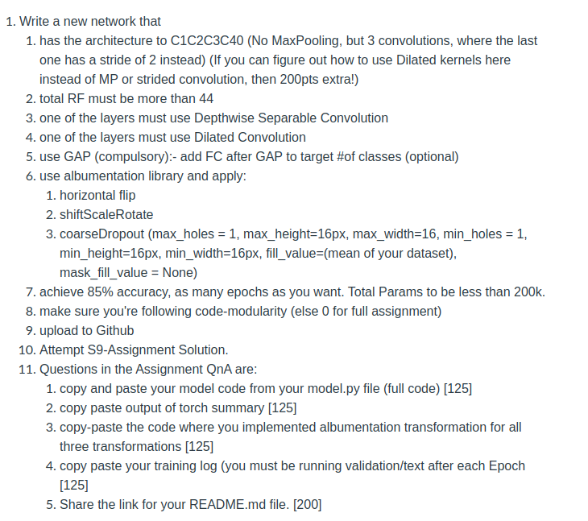
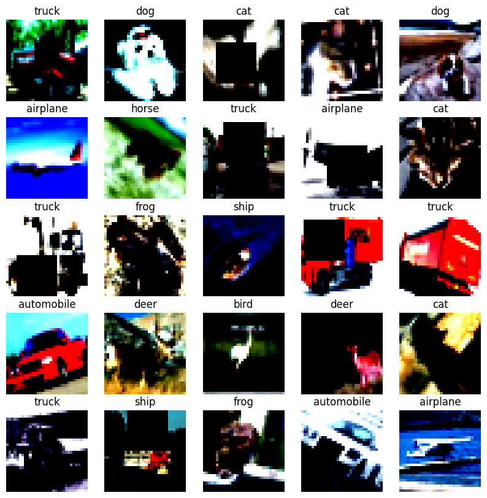
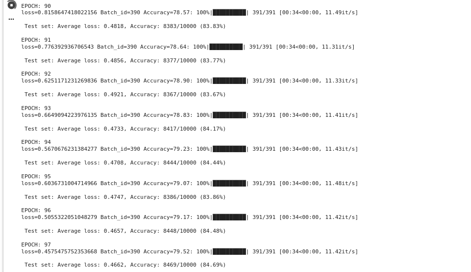
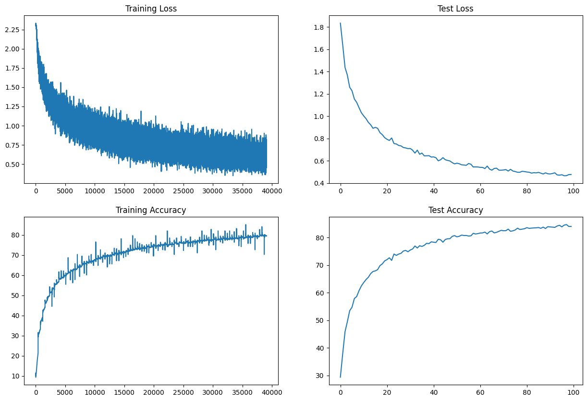
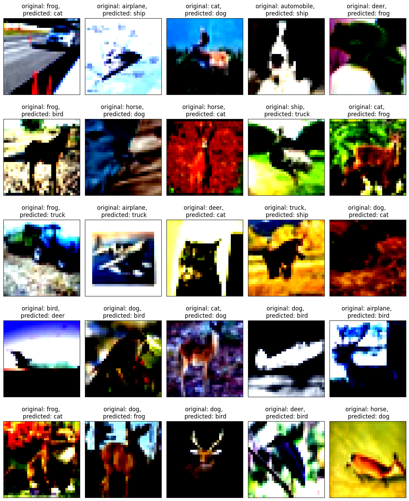

# Problem Statement

# Sample Images

# Network Architecture

| **Block**      | **Layer**   | **In channels** | **Out Channels** | (Kernel, stride,padding, dilation) |
|----------------|-------------|-----------------|------------------|------------------------------------|
| **INPUT**      | convolution | 3               | 16               | (3,1,1,1)                          | 
| **CONVBLOCK1** | convolution | 16              | 32               | (3,1,1,1)                          |
| **CONVBLOCK1** | convolution | 32              | 32               | (3,1,1,1)                          | 
| **CONVBLOCK1** | dilated     | 32              | 128              | (3,1,1,2)                          |
| **CONVBLOCK2** | depthwise   | 128             | 128              | (3,1,1,1)                          | 
| **CONVBLOCK2** | pointwise   | 128             | 64               | (1,1,1,1)                          |
| **CONVBLOCK2** | convolution | 64              | 64               | (3,1,1,1)                          | 
| **CONVBLOCK2** | dilated     | 64              | 32               | (3,1,1,2)                          | 
| **CONVBLOCK3** | depthwise   | 32              | 32               | (3,1,1,1)                          |
| **CONVBLOCK3** | pointwise   | 32              | 64               | (1,1,1,1)                          |
| **CONVBLOCK3** | convolution | 64              | 64               | (3,1,1,1)                          |
| **CONVBLOCK3** | dilated     | 64              | 16               | (3,1,1,2)                          | 
| **OUTPUT**     | GAP         | NA              | NA               | (6,None,0,None)                    |                 
| **OUTPUT**     | convolution | 16              | 16               | (3,1,1,1)                          | 
| **OUTPUT**     | FC1         | 64              | 32               | NA                                 |                 
| **OUTPUT**     | FC2         | 32              | 10               | NA                                 |                 

# Model Performance

| Number of Parameters | Train Accuracy | Test Accuracy |
|----------------------|----------------|---------------|
| 189,978              | 79.52%         | 84.69%        |

# Misclassified Imges

